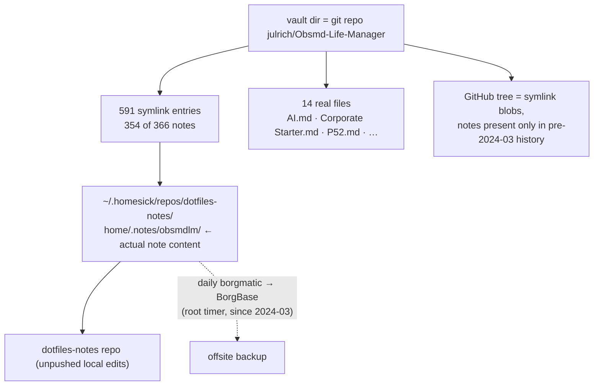
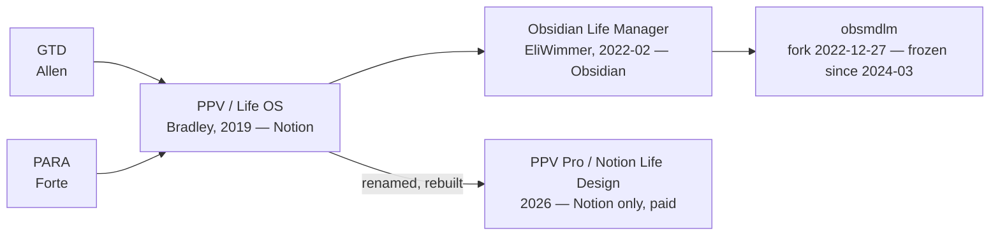
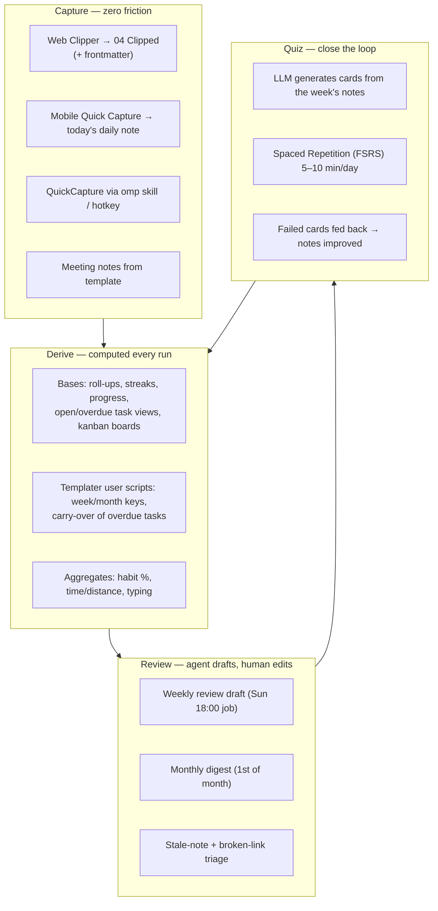

---
tags:
  - vault-plan
created: 2026-10-08
status: draft
---

# obsmdlm — Overview, Heritage & Automation Plan

Written 2026-10-08 on the running app (Obsidian 1.13.7, 1.14.4 downloaded and pending restart) with the vault open. Everything marked ✅ was verified by execution on a throwaway copy of this vault in `/tmp` (live vault untouched, no writes except this document). Items marked ⟡ are inferences that still need a decision or a check.

Your own backlog already contains this plan — three open tasks, all overdue since February 2023:

- `02 Action/02 Projects/Initialize Second Brain.md:34` — *"Add review of hours spent, distance biked, progress made on values, goals and projects and focus status to weekly review automatically (aggregate up to monthly, too) 🔼 📅 2023-02-11"*
- `…:52` — *"Create a process and template for weekly and monthly reviews ⏫ 📅 2023-02-15"*
- `…:29` — *"Add related meeting notes to daily notes automatically (`dataviewjs`?)"*

---

## 1. Overview — what this vault is today

| | |
|---|---|
| Identity | Fork of `EliWimmer/Obsmd-Life-Manager` (OLM), personalised since 2022-12-27; repo `julrich/Obsmd-Life-Manager` |
| Method | PPV-style alignment hierarchy (Values → Goals → Projects → Tasks) + PARA folders + GTD task conventions, all rendered by Dataview/Tasks dashboards |
| Content | 366 md, 163 png. 80 daily notes, 90 meeting notes, 23 people, 15 projects, 7 goals, 3 values, 12 clippings |
| Storage | 591 of 605 tracked paths are **symlinks** (mode `120000`) into `~/.homesick/repos/dotfiles-notes/`; only 14 files are real (12 md + 2 `.base`) |
| App state | 16 community plugins, all frozen at 2023-03 versions; theme Minimal 6.1.17; obsidian-git autocommits every 20 min and pushes |
| Activity | Peak 2022-12-27 → 2023-03-26 (190 commits in Jan 2023 alone); dailies stop 2023-03-26; 2026 total ≈ 30 added lines across 6 work notes |



**Backup reality:** the GitHub mirror of this repo no longer contains note text; content lives in the homesick castle, which *is* covered by the daily root borgmatic run to BorgBase. So the notes are safe — the GitHub repo is simply not a backup any more.

### Working vs broken (verified)

| Mechanism | State |
|---|---|
| 16/16 plugins loading on 1.13.7 | ✅ zero console errors after load |
| Dataview 0.4.26 | ✅ indexes all 366 pages / 368 tasks; parses inline fields, links, `full-date`, banners |
| Tasks 1.4.1 | ✅ accepts the query syntax used in the 247 tasks-queries |
| Banner image URLs (113 http banners) | ✅ 11/12 sampled still 200 |
| **Template application on note creation** | ❌ **broken — produces 0-byte notes** (see §3.3 W1) |
| Habit capture | ❌ manual by design since Metaedit broke (`07 Guide/Daily Note.md:59`) |
| Weekly/monthly reviews | ❌ never established (1 weekly note, 0 monthly) |

### Why the upkeep never happened

1. **The template deliberately gave you no review process.** `07 Guide/Periodic Overviews.md:23` — *"intentionally left blank to allow for your own weekly review process"*; same for monthly at `:34`. There is no review template, no review checklist, no prompts — only display tables. You had to invent one and never did (0 monthly notes in 4 years).
2. **The one-click habit input was already broken in the template's own documentation.** `07 Guide/Daily Note.md:59` — *"Currently the plugin Metaedit is not working correctly, so the daily habits should be manually filled in with a ✅ or ❌ emoji."* Metaedit isn't installed in this vault at all. Result: exercise filled 4/80 days (5%), plan-next-day 23/80, keep-time 32/80, bike log ~2/80.
3. **Manual cost per interaction was high.** 13–17 inline fields per daily note (~1,100–1,300 across the 80 dailies); a weekly review would touch ~44 notes (open tasks), 15 projects, 7 goals; task carry-over was itself a manual task (`2023-  Wk 1 Tasks.md:5`).
4. **The ritual was coupled to a work cadence that ended** (ExE/kickstartDS standups, 88 of 90 meeting notes Dec–Mar). When the trigger disappeared, only the unaided habit remained, and it collapsed in three weeks.
5. **Nothing automated the upkeep.** Verified on this machine: the only scheduled jobs that touch notes are the in-app obsidian-git autocommit and the root borgmatic backup. No cron/timer anywhere invokes an LLM; `inotifywait` and `entr` are installed but unused; taskwarrior/timewarrior (the pre-Obsidian era) are uninstalled with no data left.

> Diagnosis: this was never a discipline problem. It was an unautomated, high-friction, template-blank process — and the one input shortcut it depended on was documented as broken and then lost with its plugin.

---

## 2. Heritage — where this approach comes from, and where it went

**Lineage.** GTD (David Allen) and PARA (Tiago Forte) are the two upstream methods — your `01 Notes/02 Resources/04 Clipped/` holds Forte's *PARA Part 1–8*, *PARA+GTD Obsidian setup*, *My Obsidian GTD setup*. Bradley's PPV (Pillars/Pipelines/Vaults, 2019, built in Notion) merged that lineage into a full life-OS with an alignment hierarchy and knowledge resurfacing. OLM is the 2022 Obsidian port of PPV; your vault is OLM plus local conventions (`01 Notes/01 Areas/03 Software/Obsidian.md` is your operating manual: area prefixes `01-19` personal, `20-29` kickstartDS, `40-59` projects; daily/weekly/monthly review cadence; `#wait`/`#next` GTD tags).



### Upstream status (checked via GitHub API)

| Question | Answer |
|---|---|
| Is OLM maintained? | **No.** Last push 2022-02-28; created 2022-02-24 → ~4.6 years frozen. Not archived, no license, no releases, no discussions |
| Traction | 504 ★, 74 forks, 17 watchers |
| Open issue | #2 *"Is there a way to have sub-tasks and dependent tasks?"* — open since 2023-05-25, zero replies |
| Successor? | **None.** All 74 forks are personal vaults; the only fork pushed in 2026 (`TorniAccent/PPV-Obsidian`, 2026-02-02) is someone's live vault still on the old `04 Templates`/`06 Guide` layout. Your fork is the most actively pushed (2026-10-08) |
| Anything to sync? | **No.** Nothing upstream has changed since before you forked; there are no commits, releases or issues to reconcile |
| Has the methodology evolved? | Yes, away from Obsidian: PPV is now **PPV Pro** inside the paid **Notion Life Design** course (page updated 2026-08-28), rebuilt for Notion's 2026 primitives and explicitly positioning itself against tool sprawl including Obsidian. It now ships **AI Life/Biz coaches** — i.e. even the commercial successor concluded that upkeep needs automation |

**What changed in Obsidian since your fork (the real "sync" target):**

| Then (2022-12) | Now (2026-10) |
|---|---|
| Frontmatter conventions (`cssClasses`, `tag:`) | Properties, typed, case-normalised `cssclasses`/`tags` |
| Dataview dashboards | **Bases** (core): table/cards/list/**kanban** views, grouping, filters, display names, **summaries** and a **formula language** with date/list/string/number functions |
| Manual web clippings into `04 Clipped` | Official **Web Clipper** (5.3k★, active 2026-09) |
| Hand-typed journal fields | Mobile **Quick Capture** (widgets/Shortcuts → daily note, 1.14) |
| obsidian-git | Sync (paid) or git 2.41; both fine |
| Plugins you use, frozen 2023 | Dataview 0.5.68 (maintenance-mode since 2025-11), Tasks 8.4.0, Templater 2.25.1, QuickAdd 2.32.0, Supercharged Links 0.14.0, Style Settings 1.0.9, Hider 1.7.1, Minimal Settings 9.0.0, Banners 1.3.3, Buttons 0.9.13, Iconize 2.14.7. Unchanged/frozen upstream: Calendar 1.5.10, Periodic Notes 0.0.17 (2024-08), Folder Note 0.7.3, nldates 0.6.2 |
| No quiz/LLM layer | **Spaced Repetition** (FSRS/SM-2, active 2026-10-05), **Copilot** (7.8k★, active), **Smart Connections** (5.5k★, active), **mcp-obsidian** (4.5k★, active 2026-08) |

**Adopt / don't adopt.** Adopt: Bases for roll-ups, Web Clipper + Quick Capture for capture, Properties normalisation, and the *idea* of PPV's resurfacing loop (reviews that resurface what you know). Don't adopt: PPV Pro (Notion-only, paid, and it is the branch that left Obsidian); don't chase upstream OLM — it has been dead longer than you have used it.

---

## 3. Automation design

### 3.1 Principles

1. **Automation writes, you read.** Every mechanical value (roll-ups, counts, streaks, carry-over, aggregates) is computed, never typed.
2. **Human input is prose only** — intention, journal, review narrative, `Why`/`Target`. Target ≤ 3 keystroke-level inputs per day.
3. **Same workflow, human or agent.** Each automation is a documented runbook that a human can also do by hand (your AI.md rule: *"workflows a human can also do, with AI using those same workflows to automate"*).
4. **Fail loudly, never blankly.** A template that can fail must not silently produce an empty note (lesson from §3.3 W1).
5. **Derive, don't duplicate.** One source per fact; dashboards compute on read (Bases) instead of storing copies.

### 3.2 Target architecture



### 3.3 Workstreams

Each item: **what** → **how** → **trigger** → **acceptance**.

#### W0 — Decisions you must make first ⟡
- **Castle policy:** keep notes as symlinks into `dotfiles-notes` (settings stay in dotfiles, GitHub mirror is a skeleton) or move notes back to real files in the vault (visions the vault as source of truth, GitHub becomes a real backup). Recommendation: keep the castle (borg covers it), but stop treating the GitHub repo as a backup and add `dotfiles-notes` to the backup story explicitly.
- **Habit field location:** keep inline `[Exercise :: ✅]` (Dataview reads it today, but nothing can toggle it with a click) or move the 6 tracker fields to frontmatter properties (Bases can then edit them inline, sort/group, and compute streaks). Recommendation: move the *trackers* to properties, keep journal prose inline.
- **Scope cut:** accept that monthly notes may stay empty unless they earn their place (see §3.5).

#### W1 — Fix the creation path (do this first)
- **What:** every note you create from `Daily/Weekly/Monthly/Person Template` is currently 0 bytes.
- **Evidence:** `tp.user.random_picture_url("900x150","abstract texture",tp)` → `06 Scripts/random_picture_url.js` → `tp.web.random_picture` → `https://source.unsplash.com/random/900x150?...` → **HTTP 503 + no CORS header** → the `Obsidian Vault — Overview & Automation Plan (2026-10-08)` throws → Templater aborts → empty file. Reproduced live: `2026-10-08.md` came out 0 bytes with `ERR_FAILED` in the console; after replacing only the `banner:` line the same command produced a complete 1,269-byte note. This is also why `2026-09-29.md` and `Untitled.md` are 0 bytes.
- **How:** in the 4 templates, replace the banner expression with either nothing or a fetch-free URL — `https://picsum.photos/seed/undefined/900/150` (verified: 302 → 200 `image/jpeg`). Keep a static fallback; the existing 113 banner URLs still resolve.
- **Trigger:** manual, today. **Acceptance:** create today's daily note; it contains frontmatter + all sections, and *no* console errors.

#### W2 — Habit capture that cannot break
- **What:** 3 habits (+ optional logs) toggled in ≤ 2 clicks, on desktop and phone.
- **How (recommended):** tracker fields → frontmatter properties on daily notes (`exercise: false`, `plan-next-day: false`, `keep-time: false`), then a **Bases kanban/table view of the last 14 daily notes** with inline editing — click to toggle; no plugin, no Metaedit class of failure. Alternative if you want to keep inline fields: one small Templater user script `toggle_habit.js` bound to hotkeys/QuickAdd commands that rewrites today's daily note field. ⟡ Decide in W0.
- **Trigger:** Bases board pinned in the sidebar; phone via a Base too. **Acceptance:** ≥ 90% of days have all three fields set by you, with zero typing.

#### W3 — Roll-ups instead of manual tables
- **What:** the Alignment dashboard, habit tables, project/goal progress.
- **How:** author `.base` files (plain YAML — scriptable and LLM-writable) for: daily trackers (last 30), project board (kanban by `area`, `complete`), goals progress (formula: linked projects done / total), task views (open/overdue/upcoming/no-project), and "notes needing attention" (no links, stale `mtime`, missing `area`). Keep the existing Dataview blocks until each is replaced; Dataview is in maintenance mode, Bases is core and gets features (kanban + grouping landed in 1.14.4).
- **Trigger:** n/a (computed on view). **Acceptance:** the Alignment dashboard and all five task views render without Dataview; habit % and project progress appear as computed columns.

#### W4 — Weekly and monthly reviews that draft themselves
- **What:** the review process the template never provided.
- **How:** upgrade `05 Templates/Weekly Template.md` into a *review scaffold*:
  1. auto: period roll-ups (tasks completed this week, still-open items carried from last week, meetings held, notes created);
  2. auto: **carry-over** — a Templater/QuickAdd user script rewrites overdue open tasks (currently 68 of 258 open tasks are overdue) into the new week's section instead of a manual "Move overdue tasks…" step;
  3. **agent draft**: an `omp -p` job reads the week's daily + meeting notes and git log and writes *"What happened · decisions · open loops · candidate next actions"* into the note, clearly marked as a draft for you to edit;
  4. human: three prompts only — *what moved, what didn't, one thing to change*.
- **Trigger:** systemd **user** timer (user timers already work on this box: `tmux.service`, `ssh-agent.service`, `herdr-status-bridge.service`) — Sunday 18:00 weekly, 1st-of-month 08:00 monthly, running a headless omp session with a vault-scoped skill.
- **Acceptance:** 4 consecutive weekly notes exist with a completed human section, each review taking < 10 minutes.

#### W5 — The LLM layer (what the maintenance work should be)
- **Weekly digest** — as W4.3. Model picks the *slow* role; runs unattended (`omp -p --mode json --max-time 15m`), artifacts logged per run.
- **Clip triage** — Web Clipper saves into `04 Clipped` with frontmatter; a nightly job classifies new clippings (adds `area::`, `status::`, tags, extracts 3 key points) and proposes where they belong; today's 3 loose root clippings get filed the same way.
- **Stale-note triage** — weekly: notes not touched in > 180 days that still carry open tasks or `[Complete :: ❌]` → proposal list for archive/close/keep. (21 open `Complete :: ❌` items exist.)
- **Meeting → actions + cards** — each meeting note yields Tasks-formatted actions (`📅` due, priority) and 2–5 quiz candidates; this converts the 90 existing meeting notes from an archive into a resource.
- **Vault QA advisor** — `WATCHDOG.yml` roster entry (`note-keeper`: `read`/`grep`/`glob`) so that whenever you work in the vault through omp, a reviewer flags broken links, missing fields, orphan attachments, dangling anchors. (Known debt it would catch today: `Team` field queried but never defined in 23 people notes, `ccard` blocks with no provider plugin, `cssClasses`/`tag` singular, stale `04 Templates`/`06 Guide` paths in `.obsidian/workspace`, ~27 dead wikilinks.)
- **Skills, not one-off prompts** — package the three recurring workflows as `SKILL.md` packs (`weekly-review`, `clip-triage`, `quiz-from-notes`) so they are versionable, human-runnable and agent-runnable.
- **Acceptance:** the weekly job runs unattended twice; each output is a draft you edit rather than a blank page; every clip from the previous week is filed with an area.

#### W6 — Quizzes / spaced repetition (the "keep it alive" loop you already speculated about)
- **What:** your AI.md already asks for *"quiz workflows to make it more feasible to keep up-to-date"*.
- **How:** install **Spaced Repetition** (FSRS, actively maintained: `#flashcards` deck tags, `Question::Answer`, `Question:::Answer` reversed, cloze via `==highlight==`). Because card syntax is the same `::` idiom already used in this vault, cards can live inside the source notes. The LLM job generates 5–10 cards per week from the notes you actually worked on (project decisions, meeting outcomes, API/tooling facts, `Token and Environment variables`-style runbooks), tagged `#flashcards/<area>`. Feed failures back: cards you keep failing point at notes that need rewriting.
- **Trigger:** weekly generation job; daily 5–10 min review in Obsidian/mobile. **Acceptance:** ≥ 20 cards/month generated, ≥ 4 review sessions/week, and at least one source-note rewrite per month driven by failed cards.

#### W7 — Task hygiene
- **What:** 368 tasks, 258 open, 68 overdue, 151 with due dates, **0** carrying the `#next`/`#wait` tags your own manual mandates.
- **How:** either enforce the tagging convention mechanically (the LLM layer tags new tasks, and an "untagged open tasks" Base view keeps it honest) or drop it explicitly — dead conventions cost trust. Stop creating weekly task files (the pattern died at Wk 6); one inbox plus computed views is enough.
- **Acceptance:** overdue count trending down; open tasks per project visible in one Base; no `#next`/`#wait` convention left half-alive.

#### W8 — Capture at the speed of thought
- **What:** your AI.md asks for *"copy & paste workflows, shortcuts to send content to notes"* and *"integrated TODO lists / shortlists for quick dumping without it getting lost"*.
- **How:** official **Web Clipper** with a vault template (route to `04 Clipped`, fill `area`, `clipped`); mobile **Quick Capture** → today's daily note; desktop: a shell `cap` function / omp skill writing straight into the inbox or daily note; keep `+ Task to Inbox` (QuickAdd) for tasks.
- **Acceptance:** a page, a thought or a task reaches the vault in ≤ 3 actions from any context; nothing lands loose in the vault root.

#### W9 — Housekeeping (cheap, high relief)
- `.gitignore` for `.obsidian/plugins/*/main.js|styles.css` + `.obsidian/workspace*`, plus a fresh repo or `git gc` — the pack is **113 MB for a 4.3 MB tree** (plugin bundles up to 5.6 MB and 8–13 MB screenshots are versioned and re-committed).
- Prune plugins: `buttons` (0 uses), `nldates`, `folder-note-plugin`, `icon-folder`→Iconize or remove; keep Dataview/Tasks/Templater/QuickAdd/Periodic Notes/Banners/Supercharged Links/Minimal Settings + new Spaced Repetition.
- Update in this order, one at a time, verifying after each: Templater 2.25 → QuickAdd 2.32 → Tasks 8.4 (**query migration required**: `due`→`due date`, `happens`→`starts`/`scheduled` across 247 blocks — mechanical, scriptable, do it in a branch since the vault is under git) → Dataview 0.5.68 (or leave it while you migrate dashboards to Bases) → cosmetics (Hider, Style Settings, Minimal Settings, Banners, Iconize).
- Normalise `cssClasses`→`cssclasses` and `tag:`→`tags:`, delete the two `Untitled*.base` stubs, remove the `starred` core-plugin flag and `starred.json` (Bookmarks superseded it).
- Replace `Periodic Notes` (frozen since 2024-08) with core Daily Notes only if you decide weekly/monthly cadences stay; otherwise it keeps working as-is.

### 3.4 Trigger map (what runs when)

| Trigger | Action | Tool | Output |
|---|---|---|---|
| Note created in `03 Periodic/**`, `02 Action/02 Projects`, meetings, people | Fill dates/keys, no network calls, never leave the file empty | Templater folder templates + `06 Scripts/*.js` | complete skeleton |
| Sunday 18:00 | Draft weekly review + carry over overdue tasks | systemd user timer → `omp -p` (+ repo skill) | draft section in the weekly note |
| Monthly, 1st 08:00 | Monthly digest (project/goal movement, habits, time) | same harness | draft monthly note |
| Nightly 03:00 | Clip triage + stale-note/broken-link report | `omp -p` job | filed clippings, triage note |
| Weekly (same run as review) | Generate/refresh flashcards for the week | `omp -p` + Spaced Repetition conventions | `#flashcards/*` cards |
| Daily, you | 3 habit toggles + journal prose | Bases board / hotkey | fields set |
| Daily, 5–10 min | Review due cards | Spaced Repetition | retained knowledge |
| Every edit | Vault QA advice when working via omp | `WATCHDOG.yml` advisor | advisory notes |
| Every 20 min | Commit + push | obsidian-git (unchanged) | history |

### 3.5 Deliberate cuts

- **Metaedit-style habit buttons:** never reintroduce a plugin dependency for a 3-field toggle.
- **Weekly task files:** dead pattern; views replace them.
- **Typing/bike logs as manual fields:** either auto-import (typing stats have machine-readable exports; bike data depends on your device) or delete them. ⟡ Manual 7-field typing entry is the single worst cost/benefit item in the daily note — 3% fill rate.
- **Monthly note:** keep only if it gets a computed digest; otherwise delete the folder template so it stops being an aspiration that reads as failure.
- **`#wait`/`#next`/course-review rituals:** keep only what an automation enforces.

### 3.6 Success metrics (review monthly, in the monthly digest)

| Metric | Now | Target |
|---|---|---|
| Weekly notes with completed human review | 0 since 2023-W01 | ≥ 4 consecutive |
| Habit fields set per day | 5–40% | ≥ 90% (automated input) |
| Manual fields typed per day | 13–17 | ≤ 3 |
| Review time per week | n/a | < 10 min |
| Overdue open tasks | 68 | < 15 |
| Cards reviewed per week | 0 | ≥ 4 sessions |
| Notes with no outgoing links / no area | 28 people+projects notes with empty queries | 0 |
| Plugin/version debt | 16 plugins, 2023-03 | updated in staged order, 3 pruned |

---

## 4. Roadmap

| Phase | Scope | Effort | Done when |
|---|---|---|---|
| **P0 — Unbreak** | W1 templates; delete 0-byte files; decide W0 items; W9 gitignore/gc | ~1 h | you can create today's daily note with content, and a fresh clone wouldn't carry 113 MB |
| **P1 — Stop the bleeding** | W2 habit toggles; W3 first three Bases; W7 drop dead conventions | ~half a day | toggling habits works on phone + desktop; task views live in Bases |
| **P2 — Reviews exist** | W4 weekly template + carry-over + Sunday timer; W8 clipper/quick capture | ~1 day | 2 weekly reviews completed end to end |
| **P3 — LLM layer** | W5 digest/triage/meeting extraction + skills; WATCHDOG QA advisor | ~1–2 days | weekly job runs unattended; clips auto-filed |
| **P4 — Quiz loop** | W6 spaced repetition + card generation + failure feedback | ~half a day | 4 review sessions in a week |
| **P5 — Sync up** | W9 plugin updates + Bases migration off Dataview, `cssclasses`/`tags` normalisation | staged | all dashboards in Bases, plugins current, 0 console errors |

Ordering rationale: P0/P1 remove the reasons the ritual died; P2–P4 make it cheap enough to survive a week without standups; P5 is cosmetic/debt and can be deferred indefinitely — *except* that Templater/QuickAdd updates are easier to do before you build more on their current versions.

---

## 5. Appendix — evidence and re-verification

**Key facts, sources**

| Claim | Source |
|---|---|
| Template application yields 0-byte notes; root cause = retired `source.unsplash.com` (503, no CORS) | live repro on a copy of this vault at app 1.13.7; console `Access to fetch … has been blocked by CORS policy` / `net::ERR_FAILED`; patched banner line → 1,269-byte note |
| 16/16 plugins load cleanly on 1.13.7; Dataview sees 366 pages / 368 tasks (258 open, 68 overdue) | live app introspection via CDP on the copy |
| 591 symlinks (mode `120000`), 14 real files; notes absent from the GitHub tree | `git ls-files -s`; `git cat-file -p HEAD:"01 Notes/01 Areas/03 Software/Obsidian.md"` prints a `.homesick/...` path; the 2023 commit for the same file prints content |
| Upstream frozen 2022-02-28, 504★ / 74 forks / 1 open issue (#2, 2023-05-25, unanswered) | GitHub API `repos/EliWimmer/Obsmd-Life-Manager`, `/commits`, `/issues`, `/forks` |
| PPV → PPV Pro / Notion Life Design (Notion-only, AI coaches) | notionlifedesign.com (page published 2026-08-28) |
| Bases: views incl. kanban, grouping, filters, formulas, summaries | obsidian.md/changelog 1.14.4 (2026-10-05); `obsidianmd/obsidian-help` → `en/Bases/{Bases syntax,Formulas,Functions}.md` |
| Plugin version deltas (Dataview 0.4.26→0.5.68, Tasks 1.4.1→8.4.0, Templater 1.10.0→2.25.1, QuickAdd 0.5.2→2.32.0, … ) | each plugin repo's `manifest.json` at HEAD vs this vault's `.obsidian/plugins/*/manifest.json` |
| Habit fill rates (exercise 4/80, plan-next-day 23/80, keep-time 32/80) | Dataview queries against the 80 dailies |
| No note-touching scheduler exists except obsidian-git + root borgmatic | `/etc/systemd/system/timers.target.wants/`, `~/.config/systemd/user/default.target.wants/`, empty crontabs, empty `/etc/cron.{daily,weekly,monthly}` |

**Re-verify commands**

```bash
# 1. bug repro outside Obsidian: the endpoint is dead
curl -s -o /dev/null -w '%{http_code}\n' 'https://source.unsplash.com/900x150/?abstract,texture'   # → 503

# 2. a fetch-free banner source that works
curl -sL -o /dev/null -w '%{http_code} %{content_type}\n' 'https://picsum.photos/seed/test/900/150'  # → 200 image/jpeg

# 3. clone weight (run in the vault)
git count-objects -vH | grep size-pack            # → ~113 MiB pack for a ~4.3 MB tree
git ls-files -s | awk '{print $1}' | sort | uniq -c   # → 591 × 120000 (symlink), 14 × 100644

# 4. upstream is dead
curl -s https://api.github.com/repos/EliWimmer/Obsmd-Life-Manager | grep -E '"(pushed_at|stargazers_count|forks_count)"'
```

**Open questions for you** (these change the plan's shape)
1. Castle: keep notes symlinked into `dotfiles-notes`, or move content into the vault so the GitHub repo becomes a genuine backup?
2. Habit trackers: migrate to frontmatter properties (Bases-editable) or keep inline fields + a toggle script?
3. Keep or kill: monthly notes, typing log, bike log, `#next`/`#wait` conventions?
4. Is any work-time data actually produced elsewhere (time tracker, phone, bike computer) that the vault should import instead of asking you to type it?

---

## Related notes

[[01 Notes/01 Areas/03 Software/Obsidian|Obsidian]] (your operating manual) · [[01 Notes/01 Areas/03 Software/AI|AI]] (where the backlog for this work lives) · [[02 Action/02 Projects/Initialize Second Brain|Initialize Second Brain]] (carries the 2023 review-automation tasks) · [[02 Action/02 Action|Alignment dashboard]] · [[01 Notes/02 Resources/04 Clipped/PARA+GTD Obsidian setup|PARA+GTD setup]] · [[01 Notes/02 Resources/04 Clipped/My Obsidian GTD setup|My Obsidian GTD setup]] · [[02 Action/01 Tasks/Views/⏭️ Next Tasks|Next Tasks]]
